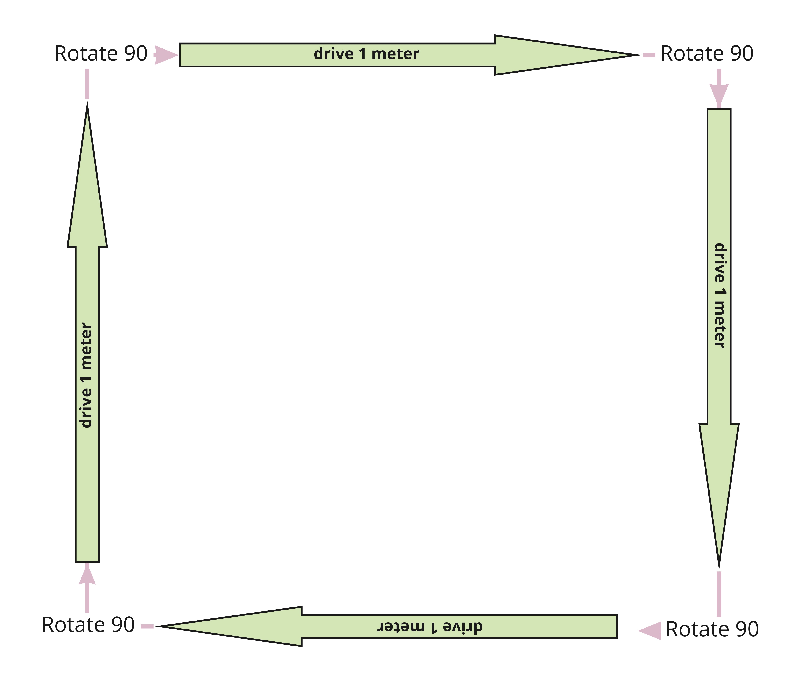
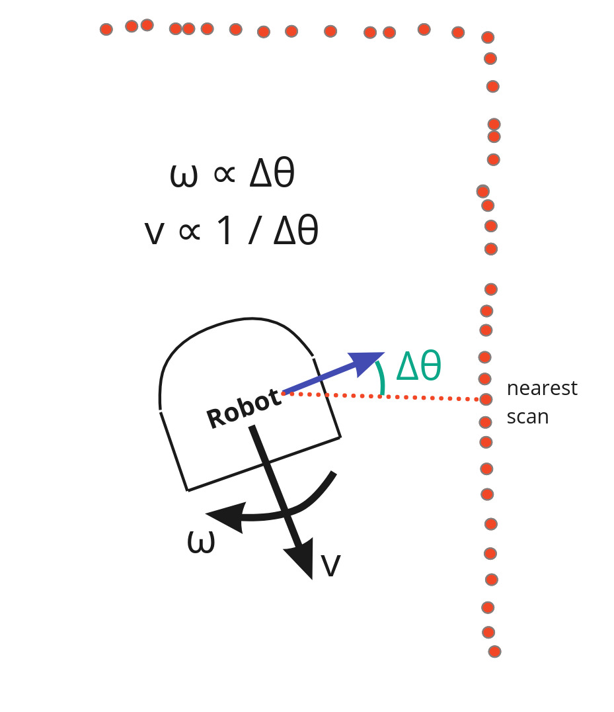
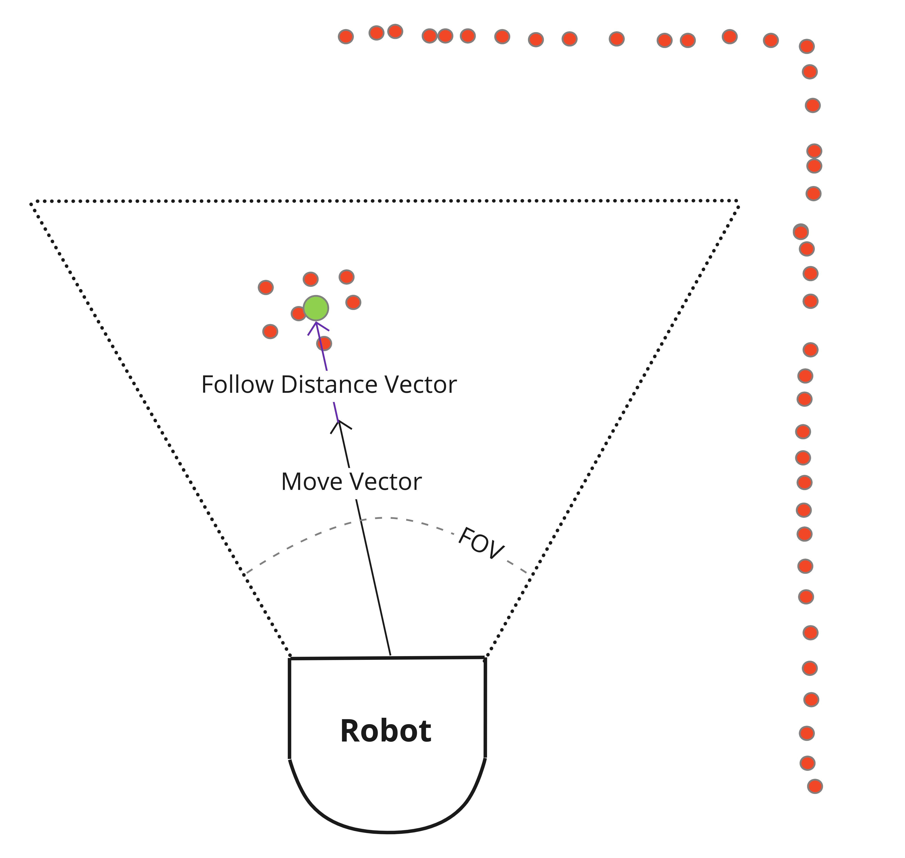
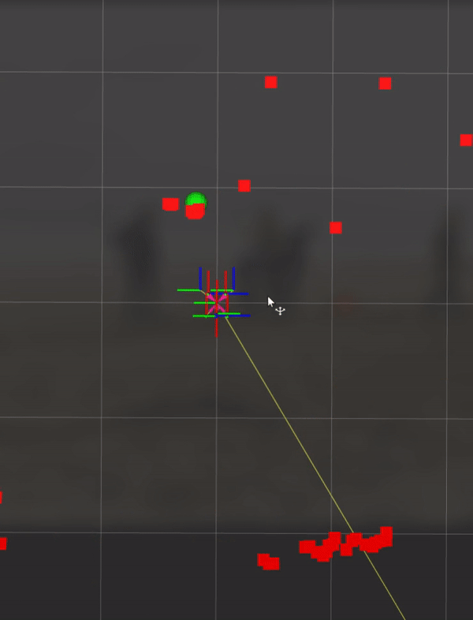
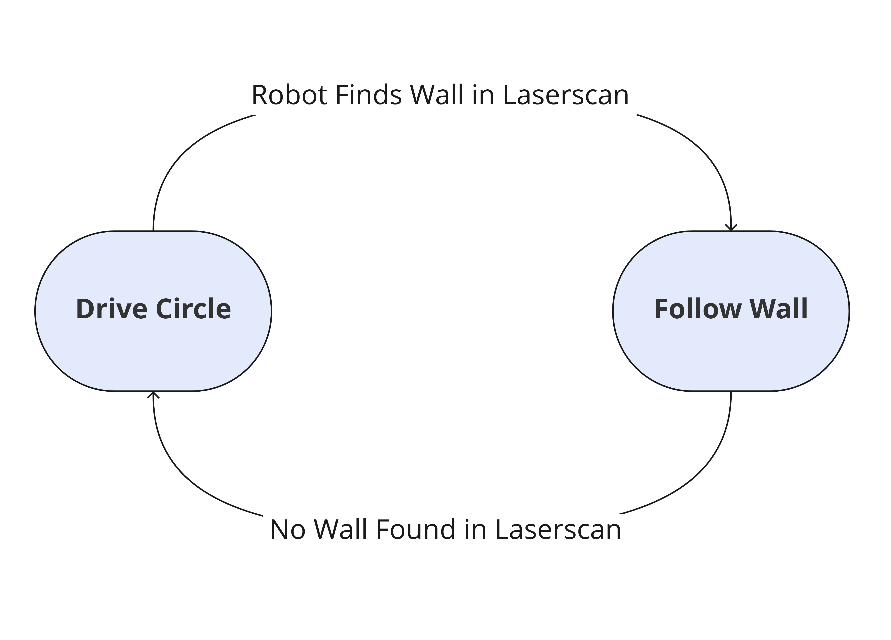
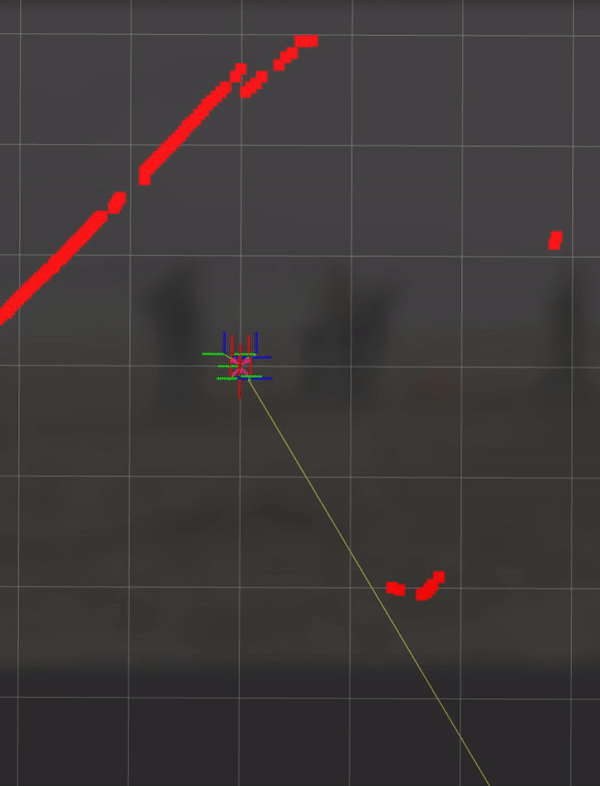

# comprobo-warmup
Olin Fall 2022 Computational Robotics Course Warmup Project  
Jonas Kazlauskas and Luke Raus

## Introduction
This package includes a series of simple behaviors we created to control a NEATO robot using ROS2. This project served to help us get comfortable working with ROS2 (i.e. writing nodes to publish & subscribe to topics, debugging with RViz, etc.) and served as a primer/refresher on developing computational robotics controls.

## Robot Teleop
Robot teleoperation is intended to allow a user to manually control a robot. We used the keyboard as our manual input controller.

### Diagram
Below are the keybindings we created for controlling the robot:
| Key      | Direction |
| ----------- | ----------- |
| i      | forward       |
| k   | stop        |
| j   | left and forward        |
| l   | right and forward        |
| u   | rotate left        |
| o   | rotate right        |
| m   | backward        |

### Strategy
A node was created to handle reading keyboard input and transforming it into robot commands which are published on the velocity command topic. Key presses are read and used to reference a dictionary of robot velocities. These velocities are then sent to the robot. We chose to let the robot continue executing the last pressed key to remove the need for holding down commands. This strategy reduced the overall number of messages sent to the robot. However, if connection is lost the robot will continue driving rather than stopping.

## Drive Square
Drive square is a behavior intended to direct the robot to drive in a 1 meter square. 

### Diagram

The desired behavior of the robot is shown above. 

### Strategy
We used timing to approximate distances and rotations for the robot. Based on the velocity commands given to the robot we set a delay that would result in the desired final position. We would love to improve on this design in the future by incorporating the odometry module's estimation of the robot position as it drives to performed (semi)-closed-loop controls, whereas currently this controller is entirely open-loop.

## Wall Follower
Our wall follower behavior is designed to direct the robot to drive parallel to walls and around corners when necessary, letting it traverse the boundary of a room or other space. 

### Diagram

### Strategy
We wrote a relatively straightforward implementation which does not strictly require the presence of a wall and instead generally keeps the robot's nearest obstacle to its left. We achieve this by identifying the nearest object to the robot with its LiDAR scan and then orienting the robot such that this nearest object is to the left.
The aligorithm at a high level:
- Retrieve and filter laser scan data to remove extraneous readings
- Identify the nearest reading in the scan and compute its angle with respect to the robot
- Compute the angular difference between this reading and the robot's "due left" direction
- Set the angular velocity proportional to this error measurement
- Set the linear velocity inversely proportional to the error

Thus we created a simple proportional controller which only drives forwards quickly when the robot is well-aligned with the wall.

Our approach comes with several pros and cons. One advantage of our choice to identify the single nearest scan from the filtered LiDAR data is that the algorithm elegantly handles complex or cluttered environments where we might want to treat e.g. a table leg or small box as the wall, rather than only those environments with a single clearly-detectable wall. This proved advantageous in several of the cluttered hallways in Olin's academic center. Our proportional velocity control also elegantly handles corners, both convex and concave.

However, one disadvantage is that the algorithm is somewhat sensitive to noise in real-world laser scan readings. Especially in hallways exposed to direct sunlight, erroneous LiDAR readings occasionally caused the robot to rotate away from the wall momentarily. While the robot would usually return to wall-following as usual, this behavior is undesirable. Performing further processing on the scan data remains an avenue for future improvement. Additionally, the algorithm currently does not incorporate knowledge of the robot's distance from the wall, and thus tends to follow the wall at roughly the distance at which it started. Incorporating a mode which attempts to control this distance is another avenue for future iteration.

## Person Follower
The goal of the person follower is to direct a robot to follow a person as they walk and move away from the robot. This behavior should keep the robot at a specified distance from the person and stop when there is not a person detected. Lidar scan data is used to 

### Diagram

The diagram above shows our implementation of the person follower algorithm.

### Strategy
Our algorithm at a high level:
- Retrieve laser scan data within a specific field of view
- Find the centroid (shown in green) of the laser scan data
- Find a vector that will move the robot from its current position to the centroid.
- Subtract a set follow distance from the vector
- Instruct the robot to drive along the vector

Field of View  
In order to prevent the robot from following walls and other large objects rather than a person, a field of view and maximum distance was used. To do this, only specific indexes of the laser scan data were used, and any values above the maximum distance were removed.

Finding the centroid  
The laser scan data is returned in polar coordinates with the robot at the origin. In order to easily find the centroid, we converted the data to cartesian coordinates using sine and cosine. We could then take the mean of the x and y values to find the centroid. 

Instructing the robot  
After finding the centroid in cartesian we converted it back to polar coordinates. Next, a specific follow distance was removed from the magnitude of the vector. The direction and magnitude were then multiplied by corresponding p values and sent directly to the robot's velocity command. This proportional controller allowed the robot to move more quickly when farther from the person in order to catch up.

### Demo

This video was recorded on a NEATO robot in a hallway. In this video the heading of the neato is always facing upward. The green spot indicates the identified person. We can see how the robot attempts the keep the person directly in front of it as it navigates within the hallway, ignoring walls.

One improvement in the future could be to find the centroid of the laser scan without converting to cartesian coordinates. This would reduce the code complexity and allow us to directly send the centroid to the robot.

## Obstacle Avoidance

### Description

### Diagram

### Strategy

## Finite State Controller

### Description
A finite state controller is a way of controlling a robot by defining a set of known states that the robot can be in. In this type of controller it is required that states and transitions between states are defined. The below diagram shows these definitions:

### Diagram

In our implementation, the robot begins by driving in a circle. If it finds a wall within a certain range, the robot will then follow the wall. When a wall is no longer in range, it will return to driving in a circle.

### Strategy

The state of the robot is tracked by an enum, which is periodically checked by our loop. Commands are being constantly sent to the robot depending on the state. A separate loop is updating the state based on the latest laser scan data. Currently all the code is structured under one main class that handles controls. In the future we would like to improve this design by creating an abstract controller without hard coded states and transitions. 

### Demo

This video was recorded on a neato in a large hallway. We can the see the robot begin by turning in a circle until it reaches the wall. At that point it aligns with the wall and begins driving along it.

## Code Structure
For each behavior we created a new ros node. Each node is a Python class that holds parameters, constants, and relevant methods. Each node subscribes and publishes to other nodes in order to retrieve robot data and send commands to the robot. Many behavors inlcude a process_scan and run_loop method. Process scan handles processing and filtering laserscan data and updating class attributes. The run_loop method is continously reading class attributes and sending commands to the robot. This design structure decouples the robot behavior from any particular input. For example we could add another sensor that updates our class attributes without needing to change our run_loop method.

## Challenges
A large challenge for us was debugging robot behavior, especially in the person follower. There were some problems with our cartesian coordinate conversions that were resulting in unexpected robot behavior. Our normal debugging strategies were not able to solve the problem and it was only after visualizing the centroid of the person that we realized where the error was coming from. Running a visualization test earlier on would prevent bugs from propogating down the line. We plan to test earlier in the future. 

Another challenege we faced was setting up the ros package in the beginning. There were a few minor steps that we were missing that prevented us from running our python code such as sourcing the setup.bash file. However after solving these problems adding in future nodes was a breeze. 

## Key Takeaways
- Using visualizations can help debug tremendously
- Start small and check functionality as you go
- Diagraming and discussing the problem before starting to write any code can be extremely helpful
- The robot will never perform perfectly in every situation - edge cases will always exist

